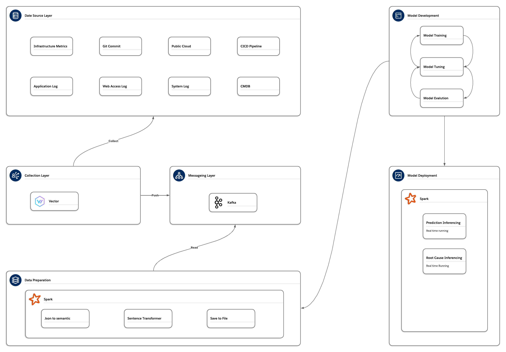

# ML monitoring
A machine learning monitoring framework using docker compose to deploy

## System Architecture


## Folder Files introduction
```
├── .github/           # GitHub Actions CI/CD pipeline
├── chaos/             # Chaos experiment scripts
│   ├── result/        # Chaos experiment results
├── fastapi-demo/      # Demo application soucre code
├── nginx/             # Demo application Nginx reverse proxy
│   ├── logs/          # Nginx logs
├── prometheus/        # Prometheus monitoring system
├── spark/             # Spark-based data processing engine
│   ├── data/          # Parquet datasets
│   ├── ivy2/          # Cached JAR dependencies
│   ├── metrics/       # Experimental result files
│   ├── models/        # Trained models
│   └── script/        # Submit Spark job scripts
├── vector-feeder/     # Log generator (simulated real application)
│   ├── data/          # Feeder input dataset
```

## Dependency
- Python 3.12
- Apache Spark 4.0.1
- Kafka 3.7.0 (Kraft mode)
- Docker Engine 29.1.0 and Docker Compose v5.0
- Prometheus 3.6.0
- Vector 0.47.0
- Chaos Toolkit 1.19.0
- FastAPI 0.121.3
- SentenceTransformer (all-MiniLM-L12-v2)

## Execution Location
All commands starting with $ must be executed on the host machine,
while commands beginning with `root@spark-master` must be executed
inside the Spark container. 
- Host machine commands
```
$
```
- Container commands
```
root@spark-master:~#
```

## Environment Setup And Preparation
### Container Startup
```
$ docker compose up -d
```
### CMDB Dataset Preparation
```
$ python spark/generate_cmdb.py
```
### Model Training Dataset Preparation
```
root@spark-master:~# run_spark semantic_preprocessing.py
root@spark-master:~# run_spark structure_preprocessing.py
```
### Test Set (labeled parquet) Generation
```
root@spark-master:~# run_spark test_labeled_parquet.py
```
## Experiment
### Experiment / Case Study 1 - Traditional vs AI-based Monitoring
```
root@spark-master:~# run_spark semantic_train.py
root@spark-master:~# run_spark semantic_inference.py

$ ./chaos/run_chaos
```
### Experiment / Case Study 2 - Structured Data vs Semantic Embedding
```
root@spark-master:~# run_spark semantic_train.py
root@spark-master:~# run_spark structure_train.py
root@spark-master:~# run_spark evaluate_models.py 
```
### Experiment / Case Study 3 - Root Cause Analysis and Feedback Learning
```
root@spark-master:~# run_spark root_cause_train.py
root@spark-master:~# run_spark evaluate_root.py 
```

